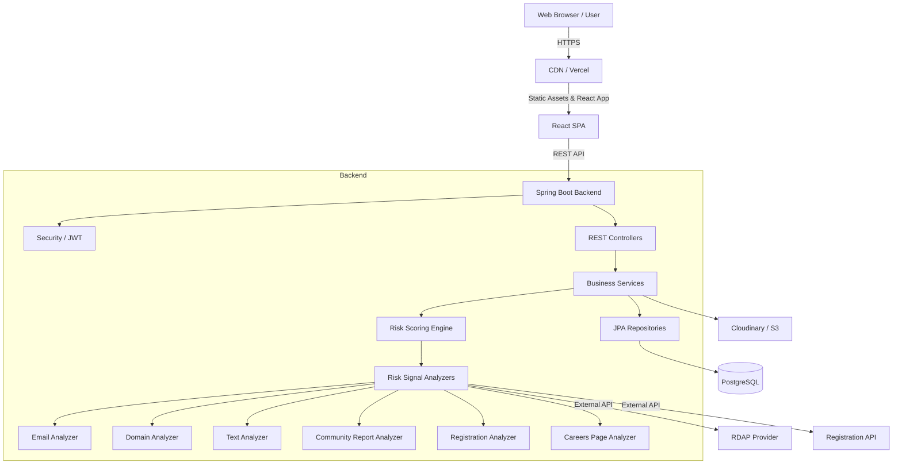

# Architecture

## System Diagram


## Component Responsibilities
- **Frontend (React/Vite)**: Presents the UI, manages client-side routing, holds JWT in memory, securely manages refresh token rotation (via HttpOnly cookies), and handles form validations (Zod).
- **Backend (Spring Boot)**: Acts as the core API provider. It enforces business rules, handles rate limiting, authentication/authorization, and orchestrates risk analysis.
- **Risk Scoring Engine**: Auto-discovers implementations of `RiskSignalAnalyzer` and executes them independently. Aggregates results, applies configurable scoring weights, floors positives at -30, and determines the final risk category.
- **Analyzers**: Implement specific checks (e.g., domain age via RDAP, job text keyword matching). They return `SignalResult`s and never fail the overall analysis (fallback to `UNKNOWN`).
- **PostgreSQL Database**: Single source of truth for users, company checks, analysis signals, community reports, caching (domain, registration, careers), and configuration (scam keywords, rules version).
- **Object Storage**: Stores user-uploaded evidence for reports (screenshots).

## Folder Structure

### Frontend
```
frontend/
  ├── public/
  ├── src/
  │   ├── assets/
  │   ├── components/      # Reusable UI components
  │   ├── config/          # Environment/API config
  │   ├── contexts/        # React Contexts (e.g., Auth)
  │   ├── hooks/           # Custom React hooks (Data fetching)
  │   ├── layouts/         # Page layouts (Navbar, Footer)
  │   ├── pages/           # Route components
  │   ├── services/        # Axios interceptors, API calls
  │   ├── types/           # TypeScript interfaces/types
  │   ├── utils/           # Helper functions, formatters
  │   ├── App.tsx
  │   └── main.tsx
  ├── .env.example
  ├── package.json
  ├── tailwind.config.js
  ├── tsconfig.json
  └── vite.config.ts
```

### Backend
```
backend/
  ├── src/
  │   ├── main/
  │   │   ├── java/com/fakecompanydetector/
  │   │   │   ├── config/        # Security, CORS, OpenAPI, AppConfig
  │   │   │   ├── controller/    # REST API endpoints
  │   │   │   ├── dto/           # Request/Response DTOs
  │   │   │   ├── entity/        # JPA Entities
  │   │   │   ├── exception/     # Global exception handler & custom exceptions
  │   │   │   ├── mapper/        # DTO to Entity mappers
  │   │   │   ├── repository/    # Spring Data JPA interfaces
  │   │   │   ├── security/      # JWT filters, UserDetails
  │   │   │   ├── service/       # Business logic (analysis, auth, company, etc.)
  │   │   │   │   └── analysis/  # Risk Engine and Analyzers
  │   │   │   └── util/          # Helpers (validation, constants)
  │   │   └── resources/
  │   │       ├── db/migration/  # Flyway SQL scripts
  │   │       └── application.yml
  │   └── test/                  # JUnit 5, Mockito, Testcontainers
  ├── .env.example
  └── pom.xml
```

## Request Flow: Company Check
1. Client submits URL/Details to `/api/analysis`.
2. Controller passes DTO to `AnalysisOrchestratorService`.
3. Orchestrator fetches available `RiskSignalAnalyzer`s.
4. Orchestrator executes all relevant analyzers. Timeouts or errors inside an analyzer result in an `UNKNOWN` signal.
5. Analyzer results (`SignalResult`) are collected.
6. `RiskScoringService` calculates the raw score, applies floors (e.g., positive floor -30, fee demand floor), and categorizes risk.
7. Result is saved to the database with a new UUID and the current `rules_version`.
8. API returns the UUID to the client.
9. Client redirects to `/results/:id`.

## Caching Strategy
- **Domain Cache**: RDAP results are stored in `domain_cache` table for `DOMAIN_CACHE_TTL_HOURS` to minimize external API costs and rate limits.
- **Registration Cache**: Similar to domain cache, stored in `registration_cache`.
- **Careers Cache**: Cached in `careers_cache`.
- Cache misses trigger live fetches. Repeated queries hit the DB cache.

## Error Strategy
- Global `@RestControllerAdvice` handles mapping backend exceptions to standardized JSON structures.
- Format: `{ "success": false, "message": "...", "errors": [...], "timestamp": "..." }`
- Analyzers never crash the app. Failed external calls yield an `UNKNOWN` status with 0 points.
- HTTP Status Codes: 400 (Bad Request/Validation), 401 (Unauthorized), 403 (Forbidden), 404 (Not Found), 409 (Conflict), 429 (Too Many Requests), 500 (Internal Error with sanitized message).
